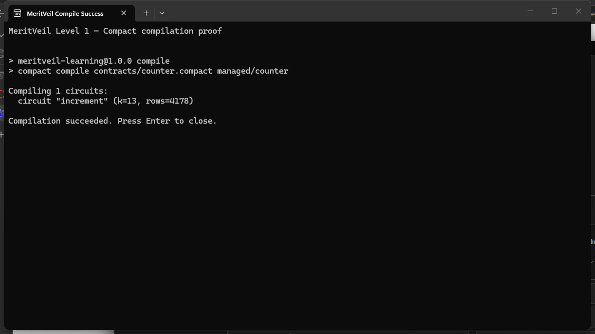
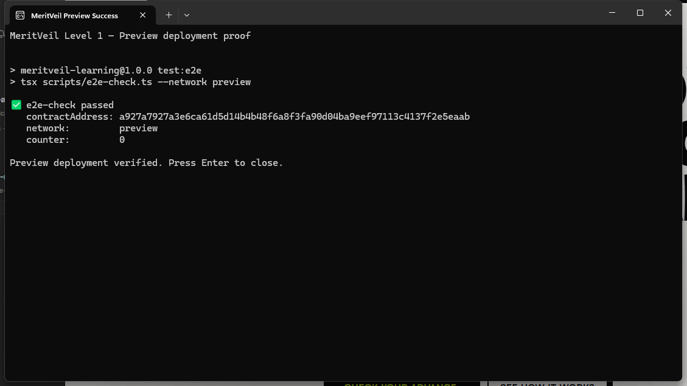

# MeritVeil Learning — Level 1

A privacy-aware Midnight learning contract: only the committed owner can increment a public counter, while the owner's secret stays private.

## Deployment addresses

| Network | Contract address | Status |
|---|---|---|
| Undeployed | `37a262a2fcfa18851566f812e562f03ff3210f2d46d4581e23b6aceb7033acd1` | Local smoke-tested |
| Preview | `a927a7927a3e6ca61d5d14b4b48f6a8f3fa90d04ba9eef97113c4137f2e5eaab` | Deployed and indexed |
| Preprod | Not deployed | Planned for Level 2 |

## Behavior

The constructor receives a 32-byte owner commitment. `increment()` obtains the owner secret from the local `secretKey()` witness, derives the same domain-separated commitment inside the circuit, rejects a mismatch, and increments the public `Counter` exactly once on success.

The CLI derives the private owner secret from the current network wallet seed, binds it through Midnight's private-state provider, and never prints it. The generated commitment is the only owner identifier sent to the constructor.

## Privacy model

| Classification | Data |
|---|---|
| Public | Counter value, owner commitment, contract address, transaction metadata |
| Private | Owner wallet seed and derived 32-byte owner secret |
| Proved without revealing | The increment caller knows a secret whose domain-separated hash equals the stored owner commitment |

The secret is never disclosed, returned by a circuit, written to ledger state, rendered, or logged. A chain observer can see when the counter changes and which contract changed, but cannot recover the secret from the stored commitment.

## Pinned stack

| Component | Version |
|---|---:|
| Node.js | 22.23.1 LTS |
| npm | 10.9.8 |
| Compact CLI | 0.5.2 |
| Compact compiler | 0.31.1 |
| Compact runtime | 0.16.0 |
| MidnightJS | 4.1.1 |
| Midnight ledger | 8.1.0 |
| On-chain runtime | 3.0.0 |
| Wallet SDK | 1.2.0 |
| Polkadot API | 16.5.6 |
| Proof server | 8.1.0 |
| Local Midnight node image | 1.0.0 |
| Local indexer image | 4.3.3 |

`package-lock.json` is authoritative for JavaScript dependencies. The `overrides` entry pins one physical `@midnight-ntwrk/onchain-runtime-v3@3.0.0`; duplicate WASM runtime instances create incompatible `StateValue` class identities during transaction assembly.

## Prerequisites

Development must run in WSL on Windows; Midnight does not support native Windows development.

- WSL 2 with Ubuntu
- Node.js 22.23.1 (`nvm use` reads `.nvmrc`)
- npm 10.9.8
- Docker Desktop with WSL integration and Compose v2
- Compact CLI 0.5.2 with compiler 0.31.1

Install and verify Compact inside WSL:

```bash
curl --proto '=https' --tlsv1.2 -LsSf \
  https://github.com/midnightntwrk/compact/releases/latest/download/compact-installer.sh | sh
compact update 0.31.1
compact use 0.31.1
compact --version
compact compile --version
```

## Setup

Run every command from the repository root inside WSL.

```bash
npm install
npm dedupe
npm run setup
```

`npm run setup` starts the local node, indexer, and proof server, compiles `contracts/counter.compact` into `managed/counter/`, and deploys to `undeployed`.

Interact with the deployed contract:

```bash
npm run cli
```

Choose **Increment counter** to generate the ownership proof and submit a transaction. Choose **Read public counter state** to confirm the indexed value and commitment.

### Preview deployment

```bash
npm run setup -- --network preview
```

The command generates a Preview wallet on first use, prints its unshielded address, waits for faucet funding, and deploys after the funds arrive. Fund it at <https://midnight-tmnight-preview.nethermind.dev/>. Wallet material, deployment state, LevelDB private state, and sync caches are gitignored.

The proof server remains local at `http://localhost:6300`; private witness data is not sent to a shared prover.

## Tests

```bash
npm run compile
npm test
npm run build
npm run test:e2e
```

`npm test` executes three behavior tests against the generated contract runtime:

1. The committed secret increments the counter from 0 to 1.
2. A different secret is rejected and public state remains unchanged.
3. Decoded public ledger state contains only the counter and commitment, not the secret.

`npm run test:e2e` reconnects to the active network deployment and verifies that the contract is indexed and its public ledger decodes correctly.

## Generated artifacts

`managed/counter/` is committed and contains:

- `contract/index.js`, source map, and TypeScript declarations
- `keys/increment.prover`
- `keys/increment.verifier`
- `zkir/increment.zkir` and `zkir/increment.bzkir`
- `compiler/contract-info.json`

## Initial Idea

MeritVeil will let communities publish quests, review completion evidence privately, and reward approved participants transparently. The production design will keep participant identity and evidence off-chain while proving that a quest organizer signed a participant-bound completion attestation before one public tNIGHT payout. Level 1 isolates the first privacy primitive: proving control of a private secret against a public commitment without revealing the secret.

## Screenshots

### Compact compilation



### Preview deployment



## Challenge progress

See [MIDNIGHT_BUILDER_CHALLENGE_CHECKLIST.md](./MIDNIGHT_BUILDER_CHALLENGE_CHECKLIST.md). Levels are submission-gated; Level 2 must not start until Level 1 has been submitted and confirmed.
