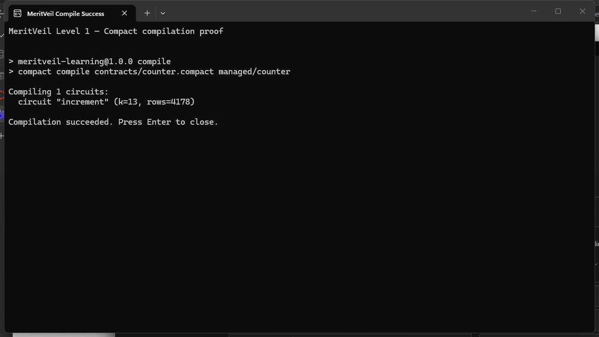
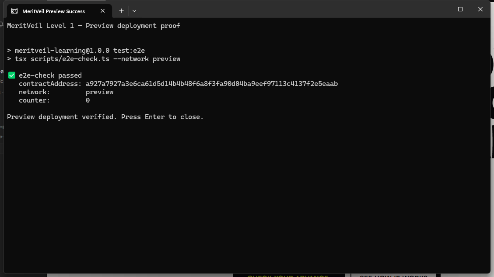
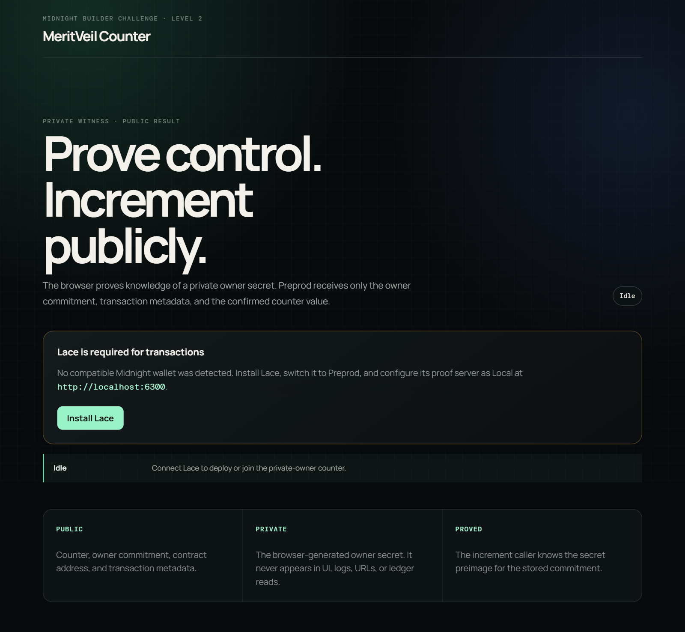

# MeritVeil Learning

[](https://github.com/polsalarm/meritveil-learning/actions/workflows/ci.yml)

> A Midnight DApp where only the committed owner can increment a public counter — proved in zero knowledge from the browser, without ever revealing the owner's secret.

## Live Demo

<https://meritveil-learning.vercel.app> · [Demo video](https://youtu.be/YX7PCYhhB-c)

Requires Chrome with Lace on Preprod and a local proof server — see [Prerequisites](#prerequisites).

## Contract Address

| Network | Address |
|---|---|
| Preprod | _Pending browser deployment — address will be added here_ |
| Preview | `a927a7927a3e6ca61d5d14b4b48f6a8f3fa90d04ba9eef97113c4137f2e5eaab` |
| Undeployed (local) | `37a262a2fcfa18851566f812e562f03ff3210f2d46d4581e23b6aceb7033acd1` |

## What This Does

The contract stores a public counter and a 32-byte **owner commitment** — a domain-separated hash of a secret. Its `increment` circuit reads the secret from a private witness, re-derives the commitment inside the circuit, rejects any mismatch, and increments the counter exactly once on success.

The browser app connects Lace, generates a fresh random owner secret that stays in the browser, deploys or joins a counter on Preprod, and increments it with a proof generated by the user's local proof server. The UI moves through *Generating proof → Submitting transaction → Confirmed on Preprod* and confirms only after the Preprod indexer reports the higher count.

A CLI (`npm run cli`) exercises the same contract on the local undeployed network and on Preview.

## Privacy Model

- **PUBLIC:** counter value, owner commitment, contract address, transaction metadata.
- **PRIVATE:** the 32-byte owner secret — kept in the browser's `localStorage` (web) or derived from the local wallet seed (CLI) and supplied only through the `secretKey()` witness.
- **PROVED without revealing:** the caller knows a secret whose domain-separated hash equals the stored owner commitment.

## Privacy Claim

An on-chain observer **sees** that a specific counter contract was incremented, the new count, the stored commitment, and ordinary transaction metadata. The observer **cannot see** the owner secret, cannot recover it from the commitment, and cannot increment the counter without it. The secret is never disclosed, returned by a circuit, written to ledger state, rendered in the UI, logged, placed in URLs, or sent to analytics. Proofs are generated by the user's own proof server at `http://localhost:6300`, so witness data never goes to a shared prover. The test suite checks this directly: the secret is absent from the public transcript and from stored ledger cells, and appears only in private witness outputs.

## Tech Stack

| Component | Version |
|---|---:|
| Compact compiler (CLI 0.5.2) | 0.31.1 |
| Compact runtime | 0.16.0 |
| MidnightJS | 4.1.1 |
| Midnight ledger | 8.1.0 |
| On-chain runtime | 3.0.0 |
| DApp connector API | 4.0.1 |
| Wallet SDK (CLI) | 1.2.0 |
| Proof server | 8.1.0 |
| React / Vite | 19.2.4 / 7.3.1 |
| Node.js / npm | 22.23.1 / 10.9.8 |
| Local node / indexer images | 1.0.0 / 4.3.3 |

`package-lock.json` is authoritative. The `overrides` entry pins one physical `@midnight-ntwrk/onchain-runtime-v3@3.0.0`; duplicate WASM runtime instances create incompatible `StateValue` class identities during transaction assembly.

## Prerequisites

**To use the live app**

- Chrome with the [Lace wallet](https://chromewebstore.google.com/detail/lace/gafhhkghbfjjkeiendhlofajokpaflmk) set to **Preprod**
- tNIGHT from the [Preprod faucet](https://faucet.preprod.midnight.network/) sent to your **unshielded** address, then tDUST generated in Lace by designating your DUST address
- Lace proof server set to **Local** at `http://localhost:6300`, and Docker to run it (`npm run proof-server:preprod`)

**To develop** — inside WSL 2 (Midnight does not support native Windows development):

- Node.js 22.23.1 (`nvm use` reads `.nvmrc`) and npm 10.9.8
- Docker with Compose v2
- Compact CLI 0.5.2 with compiler 0.31.1:

```bash
curl --proto '=https' --tlsv1.2 -LsSf \
  https://github.com/midnightntwrk/compact/releases/latest/download/compact-installer.sh | sh
compact update 0.31.1
compact compile --version
```

## Setup & Run Locally

1. Clone and install:

   ```bash
   git clone https://github.com/polsalarm/meritveil-learning.git
   cd meritveil-learning
   npm ci
   ```

2. Compile the contract into `managed/counter/`:

   ```bash
   npm run compile
   ```

3. Start the local proof server:

   ```bash
   npm run proof-server:preprod
   ```

4. Run the browser app against Preprod (optionally set `VITE_DEFAULT_CONTRACT` in `web/.env`):

   ```bash
   cp web/.env.example web/.env
   npm run dev:web        # http://localhost:3000
   ```

5. Connect Lace, choose **Deploy new** (or paste an address and **Join**), then **Increment with private proof**.

6. Optional — full local network and CLI:

   ```bash
   npm run setup                         # local node, indexer, proof server; compile; deploy to undeployed
   npm run cli                           # increment or read public state
   npm run setup -- --network preview    # generate a Preview wallet, wait for faucet funding, deploy
   ```

`web/src/config.ts` validates every `VITE_*` variable once; only `web/.env.example` is committed. Wallet material, deployment state, LevelDB private state, and sync caches are gitignored and excluded from Vercel uploads.

## Run Tests

```bash
npm test
```

Nine behavior tests run against the generated contract runtime:

- **Owner authorization** — the owner increments 0 → 1; repeated increments count 1, 2, 3; a different secret is rejected with unchanged state; an intruder mid-history is rejected while the owner continues; the original owner is rejected on a counter committed to someone else.
- **Owner commitment** — the same secret re-derives the same commitment; different secrets give different commitments; the commitment is not the secret.
- **Privacy** — decoded public state contains only the counter and commitment; the secret is absent from the public transcript and present only in private witness outputs; stored ledger cells contain the commitment but never the secret.

`npm run build` type-checks the CLI and API and builds the browser app. `npm run test:e2e` reconnects to the active CLI network deployment and verifies that the contract is indexed and decodes correctly.

## CI/CD

[`.github/workflows/ci.yml`](./.github/workflows/ci.yml) runs on every push to `main` and every pull request:

1. Checkout and Node.js from `.nvmrc`, with the npm cache
2. `npm ci` from the lockfile
3. Install the Compact CLI and pin compiler 0.31.1
4. `npm run compile` — regenerate circuits, keys, and bindings
5. `npm test` — contract behavior tests
6. `npm run build` — type-check the CLI and API, then build the browser app

Vercel builds the static app from `web/` (`vercel.json`) for pull request previews and production.

## Product Proposal

See [PROPOSAL.md](./PROPOSAL.md) — MeritVeil: private proof-of-completion rewards for community quests.

## Troubleshooting

| Symptom | Fix |
|---|---|
| "Lace is required for transactions" | Install Lace in Chrome, then reload the page. |
| Faucet says "Provided address is invalid" | Use the **Unshielded** address (`mn_addr_preprod1…`), not the Shielded or DUST address. |
| tNIGHT shows as *Pending* | Wait for the Midnight wallet in Lace to finish syncing; the first sync scans all of Preprod and can take a while. |
| tDUST tank is empty | tDUST is not sent by the faucet. In Lace, open the DUST action next to Send/Receive and designate your own DUST address; tDUST then accrues from your tNIGHT. |
| "Proof generation failed" | Start the proof server (`npm run proof-server:preprod`) and set Lace's proof server to **Local** `http://localhost:6300`. |
| "Insufficient Preprod tNIGHT or tDUST" | Wait for tDUST to accrue, then retry. |
| "No counter exists at that address on Preprod" | The address is from another network or mistyped — deploy a new counter or paste a Preprod address. |
| Increment is rejected with "owner secret does not match commitment" | Only the browser that deployed a counter holds its secret. Deploy a new counter from this browser. |

## Demo

[](https://youtu.be/YX7PCYhhB-c)

Watch on YouTube: <https://youtu.be/YX7PCYhhB-c>

## Screenshots

### Compact compilation



### Preview deployment



### Live app without Lace



## Generated Artifacts

`managed/counter/` is committed for reproducible builds and contains the contract JavaScript and TypeScript bindings, `keys/increment.prover`, `keys/increment.verifier`, `zkir/increment.zkir`, `zkir/increment.bzkir`, and `compiler/contract-info.json`.

## Challenge Progress

See [MIDNIGHT_BUILDER_CHALLENGE_CHECKLIST.md](./MIDNIGHT_BUILDER_CHALLENGE_CHECKLIST.md). Levels are submission-gated.
